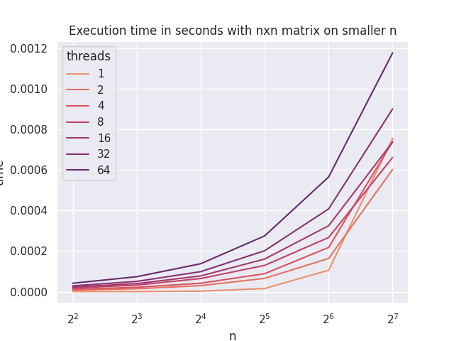
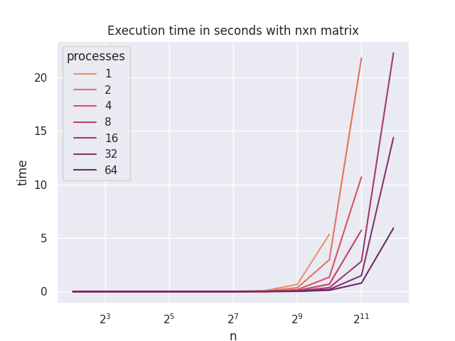
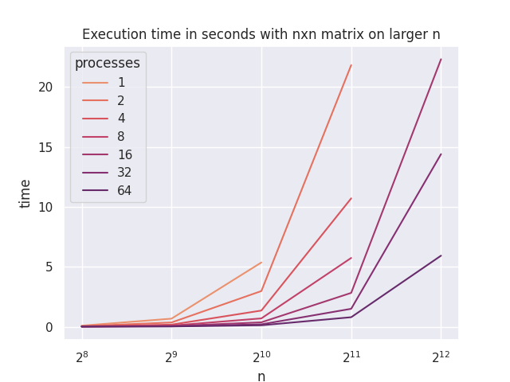

# OpenMP parallelized determinant computation

# MPI parallelized determinant computation

# Conclusion
Process parallelization comes with a lot of process communincation related computation losses so it is not reasonable to use it on smaller matrices. On larger matrices though it achieves better level of parallelization.
