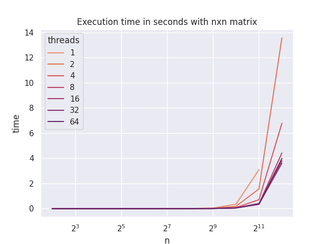
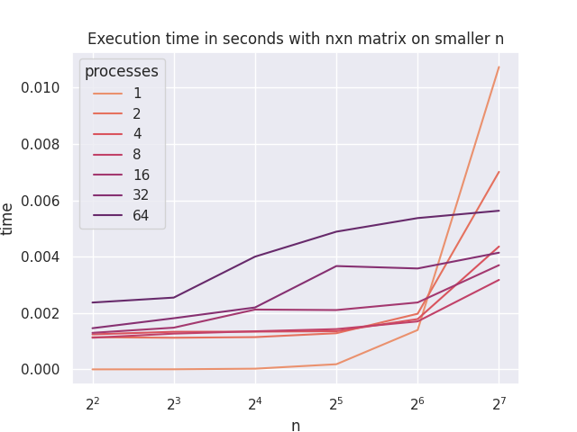

# Usage

Use flag `--help` for the list of all available options and `--mpi` to compile for MPI. 

## On MSU Polus machine

`module load SpectrumMPI`
`python3 run_polus.py [NUMBER OF PROCESSES OR THREADS] --src_file /path/to/src.c (--mpi)`

## On MSU BlueGene machine

MPI version does not work though due to the usage of group communications (as of 2021). Maybe BlueGene moderators will consider switching to newer MPI versions in future years.
`python3.3 run_bluegene.py [NUMBER OF PROCESSES OR THREADS] --src_file /path/to/src.c (--mpi)`

# OpenMP parallelized determinant computation

# MPI parallelized determinant computation

# Conclusion
Process parallelization comes with a lot of process communincation related computation losses so it is not reasonable to use it on smaller matrices. On larger matrices though it achieves better level of parallelization.
